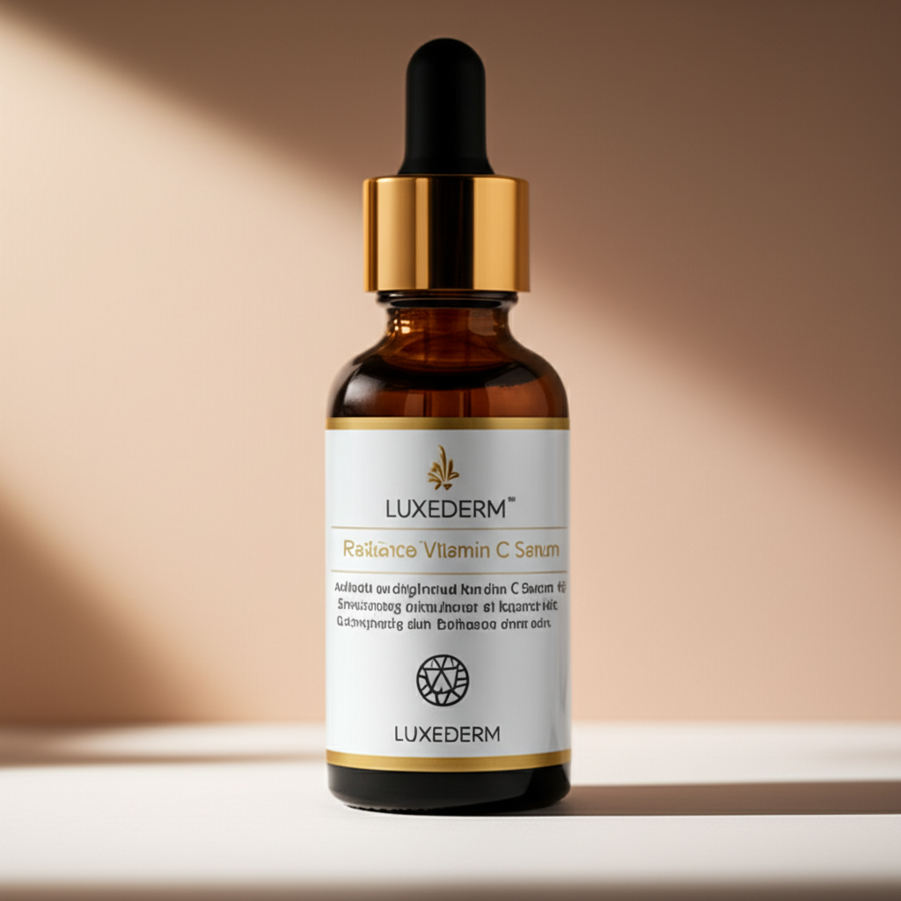

# AI Ad Generator

An intelligent ad copywriting system that generates high-converting marketing content for social media, email campaigns, and product descriptions using advanced prompt engineering and flexible tone modulation.

---

## ✨ Features

- **Multi-Platform Support**: Generate ads for Social Media, Email, and Product Descriptions.
- **Flexible Tone System**: Choose from 8 different tones to match your brand voice.
- **Real-time Streaming**: Stream responses for better user experience.
- **Product-Aware**: Contextual ads based on detailed product information.
- **Image Generation**: Generate product images to complement your ad content.

---

## 📋 Supported Ad Types

| Ad Type              | Description                     | Use Cases                  |
|----------------------|---------------------------------|---------------------------|
| `social_media`       | Instagram, Facebook, TikTok posts | Engagement, brand awareness |
| `email`              | Email marketing campaigns       | Nurturing, product announcements |
| `product_description`| E-commerce product pages        | Conversion optimization    |

---

## 🎨 Available Tones

| Tone          | Style                          | Best For                     |
|---------------|-------------------------------|------------------------------|
| `friendly`    | Warm, conversational, emoji-friendly | Lifestyle brands, B2C       |
| `professional`| Formal but approachable, credible | B2B, premium products        |
| `urgent`      | Time-sensitive, action-driven | Sales, limited offers        |
| `playful`     | Fun, humor, creative          | Youth brands, entertainment  |
| `luxurious`   | Sophisticated, premium, exclusive | High-end products           |
| `minimalist`  | Clean, simple, essential      | Modern brands, tech          |
| `bold`        | Strong, confident, assertive  | Fitness, transformation      |
| `conversational`| Natural, chat-like, relatable | Community brands             |

---

## 🚀 Quick Start

### Prerequisites

- Python 3.10 or higher.
- `uv` for virtual environment management ([Learn more](https://www.datacamp.com/tutorial/python-uv)).
- `npm` for client dependencies.

### Clone Repository

```bash
# Clone the repository
git clone https://github.com/fahmiaziz98/ad-generator.git
cd ad-generator
```

### Environment Variables
To copy the **.env.example** file to **.env**, you can use the following command in your terminal:
```bash
cp .env.example .env
```
This will create a **.env** file with the same content as **.env.example**. You can then edit the **.env** file to add your actual environment variables, such as **LUNOS_API_KEY**. you can get API Key [here](lunos.tech)
```bash
# .env file
LUNOS_API_KEY='your_api_key'
```

---

### Create & Activate Virtual Environment

```bash
cd server
# Initialize virtual environment
uv init .

# Activate the virtual environment
source .venv/bin/activate

# Install server dependencies
uv pip install -r pyproject.toml 

# Run server
fastapi dev src/main.py
```

Access API documentation at [http://0.0.0.0:8000/docs](http://0.0.0.0:8000/docs).

### Install & Run Client
Open another terminal:

```bash
# Move to client directory
cd client

# Install client dependencies
npm install

# Run client
npm run dev
```

Access the client at [http://localhost:5173](http://localhost:5173).
- **Note**: Please see api docs [here](server/README.md)

---


## 🤝 Contributing

1. Fork the repository.
2. Create a feature branch (`git checkout -b feature/amazing-feature`).
3. Commit your changes (`git commit -m 'Add amazing feature'`).
4. Push to the branch (`git push origin feature/amazing-feature`).
5. Open a Pull Request.

---

## 📄 License

This project is licensed under the MIT License - see the [LICENSE](LICENSE) file for details.

---

## 🆘 Support

- **Issues**: [GitHub Issues](https://github.com/fahmiaziz98/ad-generator/issues)
- **Email**: [fahmiazizfadhil999@gmail.com](mailto:fahmiazizfadhil999@gmail.com)

---

## 🚀 Roadmap

- [x] Add Image Generation.
- [ ] Docker deployment

---

## 🖼️ Example UI Screenshot

Below is an example of the user interface for the AI Ad Generator:

<div style="display: flex; flex-direction: column; gap: 20px;">
  
  
</div>

---

## 🖼️ Generated Images

Below are examples of generated images:

<div style="display: flex; gap: 20px;">
  
  
</div>

---

**Made with ❤️ by fahmiaziz98**